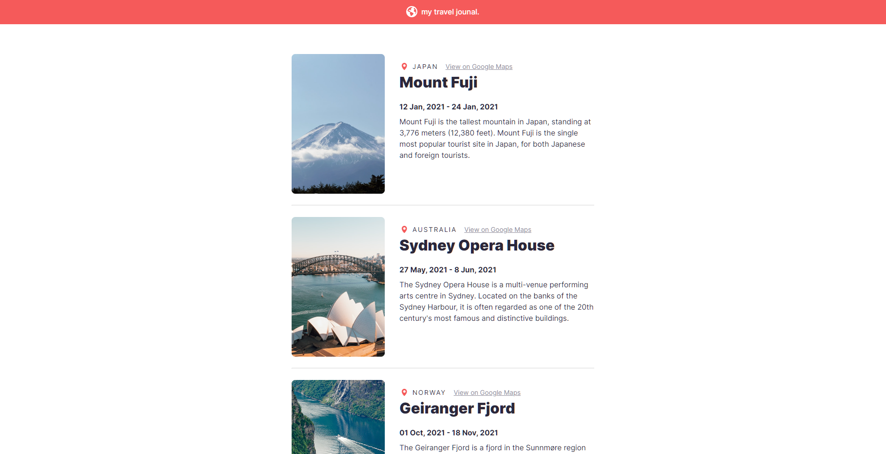
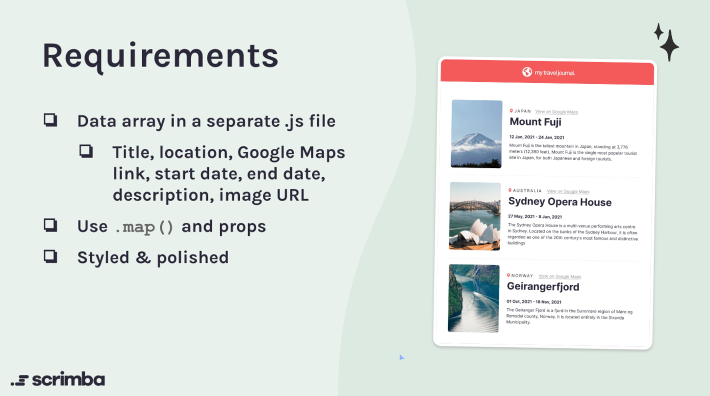

<h1 align="center">Travel Journal</h1>
<p align="center">
  Made with <code>HTML</code>, <code>CSS</code>, <code>JavaScript</code>, <code>ReactJS</code>, <code>styled-components</code>
  <br>
  Bootstrapped with <code>Vite</code>
</p>

<p align="center">
  <a href="../../commits"></a>
  <a href="./LICENSE"></a>
  
</p>

<p align="center">
  <a href="#-screenshots">🖼 Screenshots</a> • 
  <a href="#ℹ%EF%B8%8F-about">ℹ️ About</a> • 
  <a href="#%EF%B8%8F-tools">⚙️ Tools</a> • 
  <a href="#-build-project">🔨 How to Build Project</a> • 
  <a href="#-file-structure">📁 File Structure</a>
</p>

<sup>
  <p align="center">
    <a href="#-details">💡 Details</a> • 
    <a href="#-useful-resources">🔗 Useful resources</a> • 
    <a href="#-author">👤 Author</a>
  </p>
</sup>

## 🖼 Screenshots

<p align="center">
  
</p>

## ℹ️ About

This is a solution to the Scrimba React Course [challenge #2](https://scrimba.com/learn/learnreact/react-section-2-solo-project-co74f46f2b22693c5ea577559).

The challenge is to build out a Travel Journal and get it looking as close to the design as possible.

<p align="center">
  
</p>

Figma prototype: https://www.figma.com/file/QG4cOExkdbIbhSfWJhs2gs/Travel-Journal

## ⚙️ Tools

- **HTML5**
  - Semantic HTML
- **CSS**
  - styled-components
- **JavaScript**
  - ReactJS
- **NodeJS**
- **Vite**
- **Github Pages**

## 🔨 Build project

<table>
  <tr>
    <th>Command</th>
    <th>Description</th>
  </tr>
  <tr>
    <td><code>npm&nbsp;install</code></td>
    <td>Installs required npm packages. Run it before building the project</td>
  </tr>
  <tr>
    <td><code>npm&nbsp;run&nbsp;dev</code></td>
    <td>Starts a local web server with HMR (Hot Module Replacement) for development</td>
  </tr>
  <tr>
    <td><code>npm&nbsp;run&nbsp;build</code></td>
    <td>Builds the project, and outputs to the folder <code>./build</code></td>
  </tr>
  <tr>
    <td><code>npm&nbsp;run&nbsp;preview</code></td>
    <td>Start a local web server that serves the built solution from <code>./build</code> for previewing</td>
  </tr>
</table>

## 📁 File Structure

```Markdown
├── 📁 build                  Files of the build solution
|
├── 📁 docs                   Additional information, documentation 
│   └── 📁 results            Screenshots of how the application works after being fully developed
|
├── 📁 src                            Source files needed for application development
│   ├── 📁 assets                     Static assets: images, icons, favicons
│   ├── 📁 components                 React components
|   |   └── 📁 Component Name
|   |       ├── 📝 index.jsx          Component logic
|   |       └── 📝 index.styled.jsx   Component styles
│   ├── 📁 styles                     Global styles
│   ├── 📝 App.jsx                    App React component
│   ├── 📝 App.styled.jsx             App styles
│   ├── 📝 data.js                    Data for displaying images
│   ├── 📝 index.html                 Main html file
│   └── 📝 index.jsx                  Entry point for the module bundler
|
├── 📝 .gitignore             Instructions for Git about what files to ignore
├── 📝 LICENSE                MIT License. Basically you can do whatever you want with the code
├── 📝 README.md
├── 📝 package-lock.json      Keeps track of the exact version of every package that is installed
├── 📝 package.json           Various metadata relevant to the project, scripts, dependencies
└── 📝 vite.config.ts         Vite configuration file
```

## 💡 Details

I spent 10 times less time on this project than on the previous also ReactJS one. Just used the structure defined in the previous project. I realy enjoyed the coding process!

## 🔗 Useful resources

- [ReactJS Course](https://scrimba.com/learn/learnreact/) - Awesome free interactive course!
- [Styled Components Crash Course & Project](https://www.youtube.com/watch?v=02zO0hZmwnw&t=738s&ab_channel=TraversyMedia) - Great tutorial explaining how to work with styled-components
- [Vite docs](https://vitejs.dev/)

## 👤 Author

- Frontend Mentor - [@GrbnvAlex](https://www.frontendmentor.io/profile/GrbnvAlex)
- Telegram - [@Arlagonix](https://t.me/Arlagonix)
- Github - [@arlagonix](https://github.com/arlagonix)
